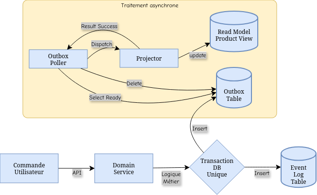
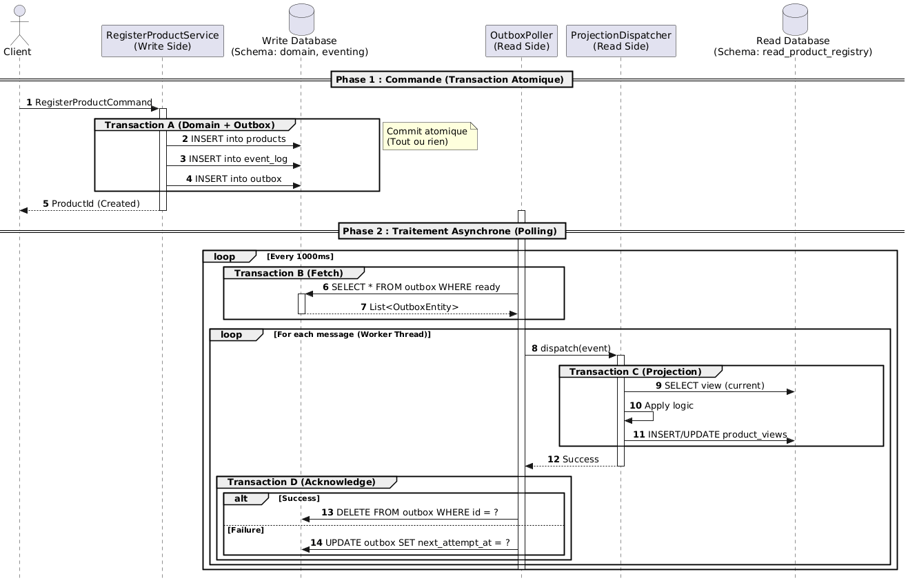

# TP Exercice 4 : Projection des événements dans des vues matérialisées

## Tâche 1 : Questions sur la base de code
1. Expliquer le rôle de l'interface `Projector` dans le système de gestion des événements.
    > Le rôle du `Projector` est de **consommer les événements de domaine** (comme `ProductRegistered` ou `ProductNameUpdated`) et de les utiliser pour **construire et mettre à jour le modèle de lecture** (la vue matérialisée) qui sera interrogé par le service de lecture.
2. Expliquer le rôle du type `S` dans l'interface `Projector`.
    > Le type générique `S` représente le **Modèle de Lecture**. C'est le type de donnée qui est mis à jour et géré par le projecteur (exemple : `Product View`).
3. Compléter la Javadoc de l'interface `Projector` en ajoutant la description de `S`.
    > Javadoc rajoutée :
    ```java
    /**
    * Interface pour les composants qui transforment les événements
    * de domaine en un modèle de lecture
    * @param <S> Le type du modèle de lecture qui est projeté et mis à jour.
    * @param <E> Le type de l'événement que ce projecteur consomme.
    */
    ```
4. Quel est l'intérêt de passer par une interface `Projector` plutôt que d'utiliser une classe concrète ?
    > L'utilisation d'une interface permet le **découpage**. La logique d'application (`ProjectionDispatcher`) dépend du contrat (`Projector`) et non d'une implémentation concrète. Cela facilite les tests et la flexibilité.
5. Quel est le rôle de la classe `ProjectionResult` dans l'interface `Projector` ?
    > La classe `ProjectionResult` a pour rôle d'encapsuler le résultat de l'opération de projection et de signaler l'issue du traitement de l'événement (succès, échec, aucun changement de vue).
6. Expliquer en quoi l'usage de la Monade est intéressant par rapport à la méthode de gestion d'erreur traditionnelle en Java et détailler les avantages concrets.
    > Sur le web (philosophie) : le terme **Monade** signifie étymologiquement "*unité*". C'est l'Unité parfaite qui est le principe absolu. (*Wikipédia*)  
    > L'usage d'une **Monade** rend la gestion d'erreur explicite et fonctionnelle.  
    > **Avantages** : Gestion des erreurs explicite (contrairement aux exceptions non vérifiées, le développeur est obligé de gérer le chemin de succès et le chemin d'erreur), clarté du flux (la Monade sépare clairement la valeur de succès de la cause d'échec) et elle permet d'enchaîner les opérations sans vérifications intermédiaires.

## Tâche 2 : Questions concernant l'Outboxing
1. Expliquer le rôle de l'interface `OutboxRepository` dans le système de gestion des événements.
   > L'``OutboxRepository`` est l'interface du dépôt qui gère la table d'Outbox. Son rôle est de garantir l'enregistrement des événements de domaine. Il permet d'ajouter un nouvel événement (en attente de publication) et de récupérer périodiquement les événements "prêts" à être diffusés ou projetés par le *poller*.
2. Expliquer comment l'Outbox Pattern permet de garantir la livraison des événements dans un système distribué.
   > Il résout le problème de la double écriture en s'assurant que la mise à jour de l'état métier (ex : l'agrégat ``Product``) et l'enregistrement de l'événement dans la table Outbox se produisent dans la même transaction de base de données locale. Si la transaction réussit, l'événement est garanti d'être dans l'Outbox et sera traité par un processus asynchrone séparé, le *Poller*. L'événement n'est donc jamais perdu entre la sauvegarde de l'état et sa publication.
3. En analysant le code existant, décrire le fonctionnement de l'Outbox Pattern concrètement dans le contexte de l'application. Créez un diagramme pour illustrer le flux des événements. Créez un diagramme de séquence pour montrer le séquencement des interactions entre les différents composants. Précisez les intéractions transactionnelles.
   > Flux des événements :
   
   > Diagramme de séquence :
     
4. Expliquer comment l'Outbox Pattern peut être utilisé pour gérer les erreurs de livraison des événements dans cette base de code. Référez-vous ici au schéma de données dans les fichiers XML liquibase et aux implémentations concrètes.
   > L'Outbox Pattern gère les erreurs de livraison/traitement grâce à des champs de statut et de suivi dans la table Outbox.

    > **Statut/Horodatage (Implémentation dans la BDD) :**
    >   * L'entité ``OutboxEntity`` (ou son schéma Liquibase) inclut typiquement un champ comme ``processed_at`` (ou un statut ``status``).
    >   * Initialement, l'événement est inséré avec ``processed_at = NULL`` (ou statut PENDING).
    >   * Une fois que le ``OutboxPartitionedPoller`` récupère un événement, s'il rencontre une erreur lors de l'appel à la projection (``ProductViewProjector``), il ne parvient pas à le marquer comme ``PROCESSED``.  

    > **Gestion de l'échec (Implémentation concrète) :**
    >   * Si le traitement échoue (ex: ``ProjectionDispatcher`` lance une exception), la mise à jour de l'état de l'Outbox (étape ``OutboxRepository.markProcessed(EventId)``) n'est pas exécutée.
    >   * Le *Poller*, lors de son cycle suivant, relira le message car son statut n'a pas été mis à jour.
    >   * Les implémentations robustes ajoutent souvent un champ ``retries`` (tentatives) ou un statut ``FAILED``. Après X tentatives d'échec, le *poller* marquera l'événement comme ``FAILED`` ou le déplacera dans une Dead Letter Queue (DLQ) logique, empêchant ainsi la relecture infinie et permettant une intervention manuelle ou automatisée pour inspecter et corriger la cause de l'erreur.

## Tâche 3 : Questions concernant le journal d'événements
1. Expliquer le rôle du journal d'événements dans le système de gestion des événements.  
    > Il fait office de source de vérité unique pour l'application. Il enregistre chaque changement sous forme d'événement immuables, permettant d'avoir un historique complet et une traçabilité totale des actions métier.
2. Pourquoi l'interface `EventLogRepository` ne comporte-t-elle qu'une seule méthode `append` ? Pourquoi n'y-a-t-il pas de méthode pour récupérer les événements ou les supprimer ?  
    > Il possède qu'une méthode `append` car le journal est conçu pour être en ajout uniquement : un événement passé ne peut être ni modifié, ni supprimé.
    > Le rôle de ce dépôt est uniquement l'écriture. Raison pour laquelle il n'y a pas de méthode de suppression ou de récupération. Il doit être immuable.
3. En tirant vos conclusions de votre réponse à la question 2 et de l'analyse de l'application (Objets liés à l'évent log, schéma de base de données), déterminez les implications de cette conception sur la gestion des événements dans l'application et quelles pourraient être les autres usages du journal d'événements.  
    > Les ***implications*** de cette conception sur la gestion des événements permet d'éviter les conflits lors des mies à jour. Et que chaque événement enregistré sera propagé sans perte au reste du système.  

    > ***Autres usages*** : reconstruire l'état d'un produit à n'importe quel moement du passé en rejouant les événements. Extraction de statistiques sur l'évolution des données sans impacter la base de production principale.

## Tâche 4 : Limites de CQRS
1. Identifier et expliquer les principales limites de l'architecture CQRS dans le contexte de l'application.  
    > **Complexité** : multiplication du code par rapport à une architecture CRUD classique.  
    > Délai entre l'écriture (Event Log) et la mise à jour de la vue, l'utilisateur ne voit pas toujours son chargement tout de suite.
2. Quelles limites intrinsèques à CQRS sont déjà compensées par la mise en œuvre actuelle de l'application ?  
    > **Perte de données** : l'usage de la table `Outbox` garantit que chaque événement sera traité même après un bug.  
    > **Ordre des événements** : La gestion par des agrégats assure que les changements sont appliqués dans le bon ordre.
3. Quelles autres limites pourraient être introduites par cette mise en œuvre ?  
    > **Latence du Polling** : Le `OutboxPartitionedPoller` vérifie la base à intervalles fixes, créant un retard systématique.  
    > **Surcharge de la base** : Le journal d'événements grossit indéfiniment, ce qui peut ralentir le système à terme.
4. Que se passerait-il dans le cas d'une projection multiple (un évènement donnant lieu à plusieurs actions conjointes mais de nature différente) ?  
    > Chaque action doit être indépendante et gérer son propre curseur de progression pour ne pas bloquer les autres.  
    > Le fait d'exécuter plusieurs fois les actions ne doit pas changer le résultat final.
